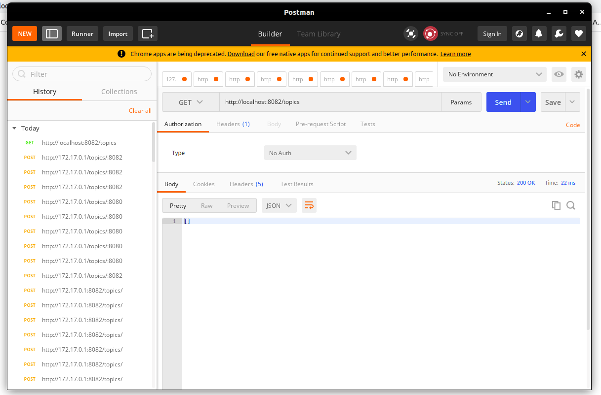
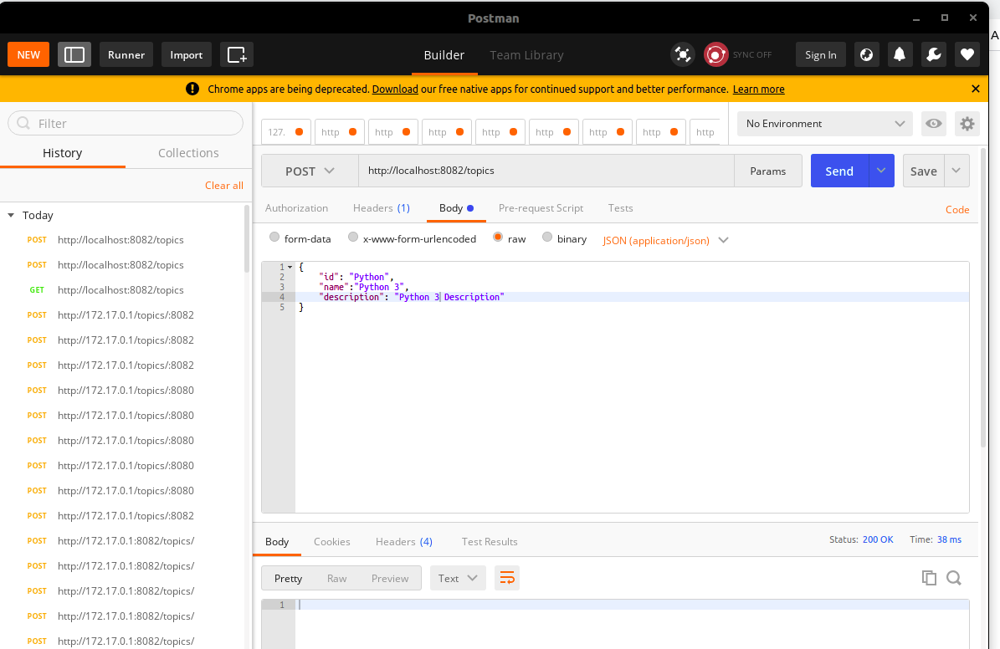

# CMS
* A RESTful api for a Course Management System
* The resources includes Topic and Course
* Different Courses can be accessed for a particular topic

# Development: Version 1
The first working version for the Course Management API

## Overview
* Code changes for this version can be seen with the commit tag "version1:commit_message"
* Development of the Topic Resource

## Implementing the following CRUD features for the Topic resource
- Accessing all the available topics
-  Accessing a particular topic
- Add a paritcular topic
- Updating a particular topic
- Deleting a particular topic

## Data Layer:
* No database was used in this version, the topic was created as an object utilising a service class implementation
* Each topic is added as an object and stored in a list, which is created on request but created only once via a service class(Singleton)

## Concepts Learned
* A fundamental understanding and implementation of OOP concepts
* A fundamental understanding of RESTful APIs
* Implemented CRUD operations for Topic Resource

## Used
* Spring Boot

# Development: Version 2
Improved version for the Course Management API

## Overview
* Code changes for this version can be seen with the commit tag "version2:commit_message"
* Development of the Course Resource

## Implementing the following CRUD features for the Topic resource
- Accessing all the available Courses
-  Accessing a particular course
- Add a paritcular course
- Updating a particular course
- Deleting a particular course

## Data Layer:
* An inbuilt database(Apache Derby) used in this version, the course was created as an object and stored in the database utilising Spring data JPA
* Each course is mapped to a topic( Foreign key ) using a many to one relationship

## Concepts Learned
* Use of JPA and Spring Data JPA
* Implementation of Entity classes and Entity relationships
* Implementation of interfaces and custom method creation in Repository class
* Implementation of CRUD features using an embedded database (Apache Derby)

## Used
* Spring Boot
* Spring Data JPA

# Deployment of Version 2
Deployment operations implemented

## Implementations
* Generation of Jar file using Maven
* Testing Jar file locally by executing command below:
```
java -jar name_of_jar.var
```
* Dockerising application via built Jar file
* Image is built and tagged with cms_api:v2.0
* Tested on localhost using postman by executing command below:
```
docker run -p 8082:8080 cms_ap:v2.0
``` 

### Testing the running container
* An initial request shows an empty record as the database is empty:



---


* Seeding the database with PUT requests creating fields for Topics resource


---

* Display of records for Topics Resource


---

* After seeding the database with courses on a particular topic (Java in our case)
* Display of records for Courses Resources


---

### Pull Image
* Published docker image to docker hub
* Image can be pulled by running the command below
```
docker pull abuyusuf/cms_api:v2.0
```